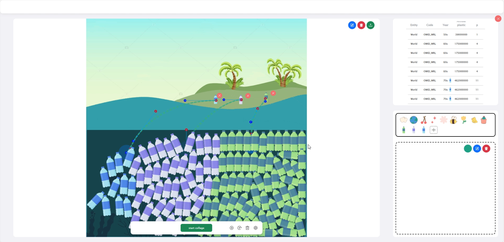

# UnitVis

The project enables users to upload CSV data on a web platform, where they can create visual patterns and target masks on a canvas. Through interactive mapping, users establish connections between the tabular data and the visual patterns, ultimately generating animated visualizations at the cell level. The frontend is built using Vue3, with UI development supported by frameworks/libraries such as Bootstrap, ElementUI, and GSAP. Canvas interactions and animation generation are handled by Paper.js. The backend is implemented with Flask and leverages PyTorch's differentiable rendering techniques to optimize the geometric arrangement of pattern tiles.



### Install & Run the client
```bash
cd unitVis-client
npm install 
npm run dev
```

This command will start a web service on port 8888 for development. You can access DG Comics at [http://localhost:8888/](http://localhost:8888/)

## Run the backend locally with Flask

### Go into the backend directory
```bash
cd unitVis-server
```

### Install dependencies
- Activate your virtual environment, i.e., virtualenv or conda (not required)
```bash
conda create --name unitVis python=3.10
conda activate unitVis
```
- Install pytorch
```bash
conda install pytorch==1.13.1 torchvision==0.14.1 torchaudio==0.13.1 pytorch-cuda=11.6 -c pytorch -c nvidia
```

- Install diffvg
```bash
git clone https://github.com/BachiLi/diffvg.git
cd diffvg
git submodule update --init --recursive
conda install -y -c anaconda cmake
conda install -y -c conda-forge ffmpeg
pip install svgwrite svgpathtools cssutils torch-tools
python setup.py install
```
Install the rest of the python packages yourself (pip or conda)
- activate Flask server
```bash
python server.py
```
 

